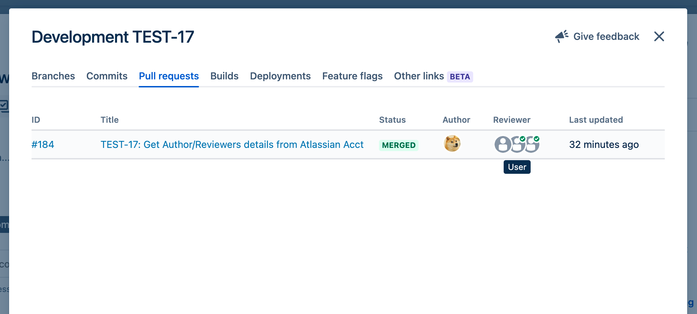
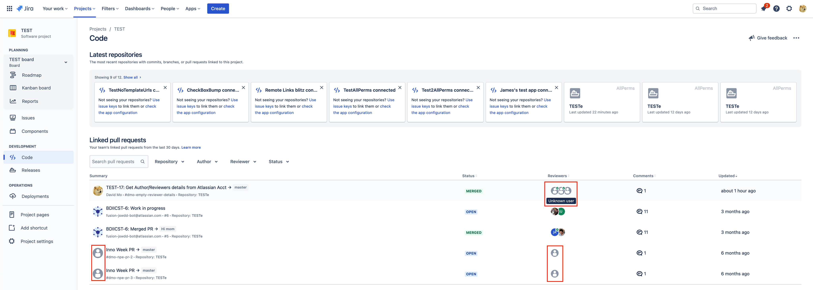
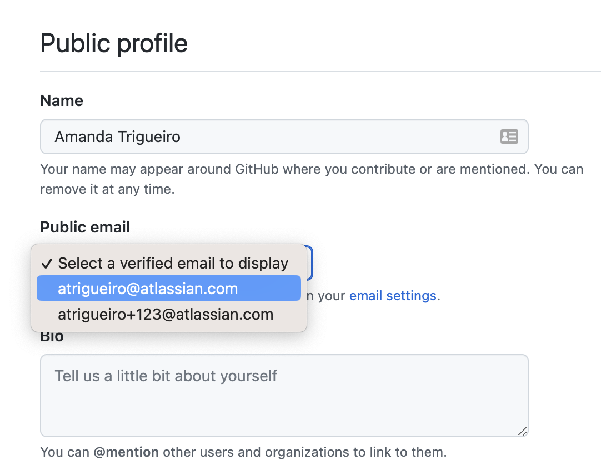
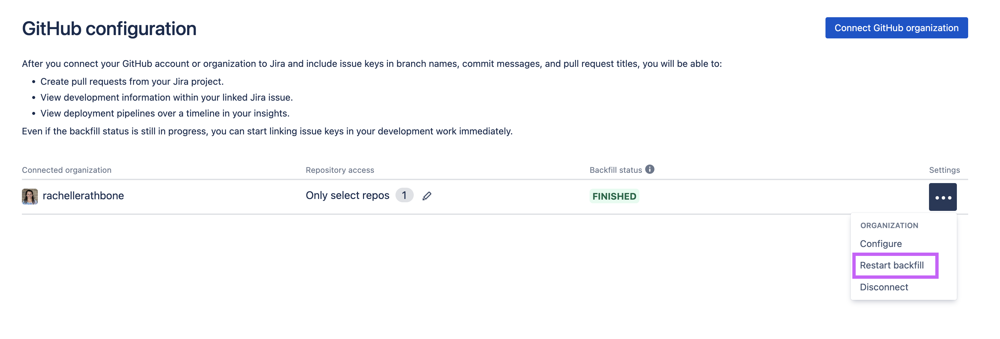
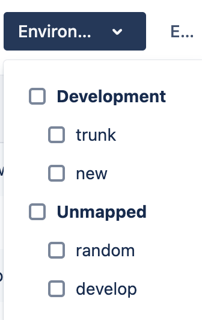

# GitHub for Jira FAQs - Questions? Need help? You've come to the right place

This file will help you troubleshoot the common issues that can occur with the GitHub for Jira integration.
If you're still having troubles after reading through this file, look up your problem or similar in [Issues](https://github.com/atlassian/github-for-jira/issues) or [Create a new Issue](https://github.com/atlassian/github-for-jira/issues/new) if it doesn't already exist.

## Table of Contents

- [General](#general)
- [Permissions](#permissions)
- [GitHub Enterprise Server](#gitHub-enterprise-server)
- [Smart Commits](#smart-commits)
- [Why can't I see the author, reviewer names, and/or icons in my Jira?](#unmapped-users)
  - [How can I add my email address from my Jira into my GitHub account](#fix-users)
- [Unmapped deployment environments](#my-deployments-are-showing-up-as-unmapped)
- [Backfilling Data](#backfilling-data)
  - [Backfill status definitions](#backfill-status-definitions)
  - [Exceeded issue key reference limit](#referencing-too-many-issues)
  - [No data showing up in Jira](#no-data-showing-up-in-Jira)
- [Deployment Mapping](#deployment-mapping)

## General
<h3>Q: Does the GitHub for Jira app support GitLab?</h3>

**A:** No. If you want to integrate GitLab with your Jira instance, you need to install the [GitLab.com for Jira Cloud app](https://docs.gitlab.com/ee/integration/jira/connect-app.html#install-the-gitlabcom-for-jira-cloud-app-for-self-managed-instances) for self-managed instances.

## Permissions

<h3>Q: The permission scope for code and metadata suggests data is read to synchronize development information. Is code stored on Jira? Should I be concerned that, were the app to be compromised, an actor could exfiltrate all our code from GitHub?</h3>

**A:** Commits, branches, and merges that occur in a connected GitHub repository will be seen on the dev panel in associated Jira issues. Whenever a commit message includes an issue key, it generates an event that is sent to Jira so the issue specified in the commit message can be updated. Our app needs code access to read commit messages and branch names to correctly link your data to your Jira issues. Our app simply sends data through to Jira, no code is stored during this process.

<h3>Q: Why does the app need metadata access to my repositories?</h3>

**A:** [Read-only access to metadata](https://docs.github.com/en/rest/reference/permissions-required-for-github-apps#metadata-permissions) is a mandatory requirement by GitHub for all GitHub apps. This access makes it possible for GitHub apps to access various read-only endpoints for a number of resources. Our app will be able to see the repository’s code, however, Atlassian takes the security of our software very seriously. We constantly monitor our code for vulnerabilities and have processes in place of making sure that it is safe to use. Additionally, GitHub documentation for metadata permissions states: “These endpoints do not leak sensitive private repository information.” If there are repositories you still don’t want our app to have access to, you have to option to select the repositories you want to grant access to when installing the app or by navigating to your GitHub settings page via the editing icon found on the GitHub configuration page or the connect an org page.


<h3>Q: What about pull requests, contents and issues? I noticed I need to grant read and write permissions. Why is this needed?</h3>

**A:** This is needed so our app can create links to Jira issues from pull request or issue comments. When you create a comment and include the issue key surrounded by square brackets, our app while ping Jira to see if that issue key exists in a project in Jira and, if it finds a matching issue, will create a link for easy navigation. As for contents, we need the write access so we can create a branch on your request.


<h3>Q: What happens if another change is made to the app in the future that requires new permissions? Can I choose to accept the new permission but ignore previously requested permissions that I don’t want/feel comfortable with?</h3>

**A:** Unfortunately not. GitHub apps are limited in this sense as permissions are not granular.

## GitHub Enterprise Server
<h3>Q: How do I set up a hole in my firewall?</h3>

**A:** Refer to [How the GitHub for Jira app fetches data](https://support.atlassian.com/jira-cloud-administration/docs/integrate-with-github/#How-the-GitHub-for-Jira-app-fetches-data).

<h3>Q: Why can’t I connect my GitHub Enterprise Server to the GitHub for Jira app?</h3>

**A:** There are a few reasons why you might have trouble connecting your GitHub Enterprise Server account to the GitHub for Jira app:

- **Atlassian IP address ranges need whitelisting** - Please see the above FAQ  - <TODO - Link to above question>

- **GitHub Enterprise Server Edition does not currently support application access via SAML SSO** - Only Github Enterprise Cloud offers this ability. [Learn more about authentication with SAML single sign-on](https://docs.github.com/en/enterprise-cloud@latest/authentication/authenticating-with-saml-single-sign-on/about-authentication-with-saml-single-sign-on#about-oauth-apps-github-apps-and-saml-sso).

- **Reverse proxy support** - GitHub for Jira does not support reverse proxies.

- **Self-signed certificate** - There is a problem with your SSL certificate.

<h3>Q: Can I connect multiple GitHub Enterprise Servers or GitHub Apps to Jira?</h3>

**A:** Yes. The GitHub for Jira app allows you to connect multiple GitHub servers. So you can connect more than one internal GitHub instance to a single Jira account.

You can also add multiple GitHub Apps for a connected server to connect any GitHub organizations to Jira. We recommend doing this as GitHub applies rate limits for GitHub Apps. Learn more about [Rate limits for GitHub Apps - GitHub Docs](https://docs.github.com/en/developers/apps/building-github-apps/rate-limits-for-github-apps).

<h3>Q: Can I create one master GitHub App in my GitHub Enterprise Server instance and connect it to multiple Jira instances?</h3>

**A:** No. A GitHub App can only be connected to one Jira instance. This is to limit access and prevent data leaks.

<h3>Q: What’s the difference between creating a GitHub App automatically vs manually?</h3>

**A:** We recommend that you create a GitHub App automatically, as this process is relatively simple. All you need to do is enter an app name and make a few selections - we’ll use a combination of the GitHub API and a manifest file to pre-populate the app creation form for you.

If you want to create a GitHub app manually, you can do so, but the process is less simple. You’ll need to create a GitHub App within your GitHub Enterprise Server account, copy several values from the new app into Jira, and copy several URLs from Jira into the app. [Learn more about manually creating a GitHub App](https://support.atlassian.com/jira-cloud-administration/docs/manually-create-a-github-app/).

<h3>Q: I want to create a GitHub App automatically, but it says my GitHub Enterprise Server must be version 3.1 or higher. Why?</h3>

**A:** There are several reasons you might want to upgrade your GitHub version:

1. **Automatic GitHub App creation:** In version 2.19.18, GitHub resolved an issue that impeded the manifest creation flow in some scenarios when a SameSite cookie policy was applied. Then, in version 3.1 support for callback_url was added, which is required by the GitHub for Jira app. You must be using version 3.1 or higher for the automatic app creation option to work.
2. **Subscribe to GitHub action events:** The GitHub for Jira app subscribes to three events that are dependent upon GitHub Actions: workflow run, deployment status, and code scanning alert. GitHub Actions is available in GitHub Enterprise Server 3.0 or higher.
3. **Stay up-to-date with GitHub releases:** GitHub routinely releases new versions and discontinues support for older versions. We recommend that you regularly update your server version for better performance, improved security, and new features. From September 28, 2022, version 3.2 will have discounted support, while versions 3.3 - 3.6 will have continued support and updates.

<h3>Q: How do I upgrade my GitHub Enterprise version?</h3>

**A:** Learn how to [upgrade GitHub Enterprise Server](https://docs.github.com/en/enterprise-server@3.4/admin/enterprise-management/updating-the-virtual-machine-and-physical-resources/upgrading-github-enterprise-server).

<h3>Q: I rotated the private key and GitHub client secret in a GitHub App in my internal instance. How do I update them in the GitHub for Jira app?</h3>

**A:** Here’s how to update your GitHub client secret or upload a new private key, or do both:

Navigate to the GitHub configuration screen in your Jira instance.

Select the 3 dots to the right of the GitHub App you want to update, then select **Edit**.

Enter a new GitHub client secret, or upload a new private key (or both).

Select **Update**.

<h3>Q: How can I create a new branch in a repository of a different organizations that I have access to? </h3>

**A:** If you are trying to search for a repository of a different organization, then make sure that this specific organization is installed in GitHub for Jira App.
Just check the **Connect a GitHub organization to your Jira site** (`/github/configuration`) page and check if that organization is installed or not.


If it's not there, make sure you install that organization.


Once you have installed it, then you will be able to search and create new branch on the repositories of that organization.

## Smart Commits
<h3>Q: I'm trying to use Smart Commits, but they don't appear to be working. What am I missing?</h3>

**A:** [[Smart Commits](https://support.atlassian.com/bitbucket-cloud/docs/use-smart-commits/)] make it easier for you and your team to comment on issues, transition issues, and add time tracking. To enable this for your team/s you will need to make sure:

- **The email address in your GitHub account matches the email address in your Jira account:** e.g. mypersonal@email.com in GitHub and mywork@email.com in Jira will prevent smart commits from work. However, mypersonal@email.com and mypersonal@email.com will work. You can check the email address on GitHub by adding `.patch` to the end of a commit URL. For example: `https://github.com/atom/atom/commit/834f8f3d73d84e98a423fe0720abd833d5ca7a87.patch`
- **You have unchecked 'Keep my email addresses private' in GitHub:** if this is checked, GitHub will not send your email address as part of the payload when a webhook is fired. Jira treats this as a mismatch between emails and fails to meet to above criteria. To update this setting in GitHub go to your **Settings** > **Emails** and then uncheck the box next to **Keep my email addresses private**.
- **You use the correct naming when transitioning:** if you want to transition an issue from one column to another, please make sure you use the same naming for the column you wish to transition to issue to e.g. if you want to flag an issue as complete and this column is called 'Done' you will need to include #done in your commit messge. #closed/#complete etc will not work unless those words are in fact in your workflow.
- **You aren't trying to 'jump' columns in your workflow:** If transitions aren't working, you may need to make sure you are abiding by the workflow set up by your team's admin e.g. if you have 3 columns 'todo', 'in progress' and 'done' but your admin has applied a rule that specifies issues can't be moved straight from 'todo' to 'done', any smart commit that tries to transition an issue from todo to done will fail. In this scenario, you need to first move your issue to #in-progress.
- **You have enabled time tracking and added to each issue type:** If you aren't seeing time tracking in your issues after adding something like `#time 1w 2d 4h 30m` to your commit message, ask you team's admin to check the site's settings. If they go to **Settings** > **Issue features** > **Time tracking** they will need to make sure that **Copying of comments to work description** is set to **Enabled**. Additionally, they will need to manually add 'Time Tracking' to any issue type (story/bug/task/etc) where this is to be recorded. Go to **Project settings** > **Issue types** and if 'Time tracking' isn't listed under 'Context fields', simply click on it in the right-hand panel and **Save changes**.

> :warning: If you're a GitHub Enterprise Server customer, your GitHub version must be 3.1.x or higher. Otherwise, you won’t be able to receive data for workflow run, deployment status, and code scanning alert events. For more information read our [FAQs documentation](https://support.atlassian.com/jira-cloud-administration/docs/integrate-with-github/#FAQs).

## Unmapped users
<h3>Q: Why can't I see the author, reviewer names, and/or icons in my Jira?</h3>

**A:** In order for the author, reviewer names, and/or icons to appear in the development panel of your Jira issue, the email address associated with your GitHub account should match the address in your Jira account. If these two email addresses are different, then the account names and icons will not show up in Jira. This behavior is similar to Smart Commits (mentioned above), which also require matching emails.





## Fix users
<h3>Q: How can I add my email address from my Jira into my GitHub account, so they match?</h3>

**A: To fix Pull Requests information**

- Go to your Emails settings in GitHub → https://github.com/settings/emails
- On Add email address, add the email you use to access your Jira (i.e. username@mycompany.com)
- Check your email inbox. You should have received an email that says [GitHub] Please verify your email address. Follow the instructions to validate your email address with GitHub. 
- Go to your Emails settings in GitHub again → https://github.com/settings/emails and make sure:
- Your Atlassian email is not showing as Unverified 
- You have not ticked the Keep my email addresses private setting.
  
- Go to your Profile settings: https://github.com/settings/profile
- On Public email, select the Atlassian email you’ve just added and verified and click Update Profile.
  

**A: To fix Commits information**

- Open the command line
- Check which email you have set on your git config ```cat ~/.gitconfig```
- If your ```user.email``` is not the one you use for Jira, you can set it by: ```git config --global user.email "username@mycompany.com"```

## My deployments are showing up as unmapped

The app does a mapping between both GitHub and Jira deployments environments names. GitHub does not have a concept of "environment type" and users can name their environments whatever they like. Jira, on the other hand, expects the types of environment, in addition to the environment name. Those can only be development, testing, staging and production. We map GitHub's environments names to one of the Jira environment types. If there's no match, Jira will consider it unmapped. The mapping logic can be found [here](https://github.com/atlassian/github-for-jira/blob/main/src/transforms/transform-deployment.ts#L126), but it simply considers [a set of common values](https://github.com/atlassian/github-for-jira/blob/main/src/transforms/transform-deployment.ts#L141) and their variations, e.g. "prod-east" and "prod-west" are considered variants of "prod".

## Backfilling Data
<h3>Q: Backfilling my data is taking a long time. When will I see my data in Jira?</h3>

**A:** When you connect a GitHub organization to Jira via the GitHub for Jira app, a process called “backfilling” begins. This process looks for issue keys in your historical data in GitHub. If it finds issue keys, it links your development data to existing issues in Jira.

When an organization contains a small amount of data, the backfilling process is relatively fast and may only take a few minutes. But when an organization contains a large amount of data, the backfilling process will take longer. The good news is you can start using issue keys in new branches, commits, and pull requests as soon as you’ve connected a GitHub organization to Jira - and this new data will be visible in Jira immediately.

Your backfill status should move from `PENDING` to `IN PROGRESS` to `COMPLETE`.

You can check your sync status in the integration settings:

**Jira Settings** -> **Apps** -> **Manage Apps** -> **GitHub** -> **Get started**


## Backfill status definitions

| Status   | Definition                 |
|----------|----------------------------|
| PENDING  | The backfilling of historical data has not started.  |
| IN PROGRESS   | The backfilling of historical data has started and is still in progress. Over time, more and more historical data will show up in Jira, and the integration will work for new data sent in. |
| COMPLETE | The backfilling of historical data has finished. Historical data will be displayed in Jira. |
| FAILED   | The backfilling of historical data hit an error and stopped without completing. Partial historical data may appear in Jira. |

The time it takes to complete the backfill will depend on the size of your GitHub organization, especially the number of commits in your repositories. Since the backfill scans branches, commits and pull requests for every repository in your installation, be mindful that selecting "All Repositories" will perform a scan of every repository in your account, including forks. If your repositories have a lot of commits, the process can take hours or even days to complete.

Because everyone's repository histories are different, it's difficult to determine how long the scan should take for a specific installation, but on average the sync can process around 100 commits per second. If it's still stuck in `IN PROGRESS` after a few hours, please check your installation for any large repositories first and attempt to restart your backfill:

1. Check that you have given permission to the repositories you want to access from Jira:
   a. For GitHub Cloud customers, open the GitHub app settings in GitHub.
   b. For GitHub Enterprise Server customers, navigate to the settings of the GitHub app in your GitHub Enterprise Server account.
2. From the settings page, select **Install App** in the left panel. Then select the **gear icon** for the organization where you want to modify repository access.
3. In Repository access, select only the repositories you wish to sync to Jira.
4. Select **Save**.
5. Open the integration settings: **Apps** -> **Manage apps** -> **GitHub for Jira** -> **Get started**
6. To restart a backfill:
   a. For GitHub Cloud connections, select the **more options icon** under Settings.
   b. For GitHub Enterprise Server connections, find the GitHub App under the connected server, select the **expand icon**, then select the **more options** icon.
7. Select **Restart backfill**.

This will rediscover all repositories in your installation and start backfilling historical data.




<h3>Q: Do I have to wait for all data to complete backfilling before I can start using the GitHub for Jira integration?</h3>

**A:** No :) The job of backfilling is to pull in all your historical data so that, if any issue keys were referenced before you installed the app, you will eventually see that data in Jira. This means you can start using the app with your team immediately as the app will start listening and responding to webhook events (real-time data) straight away.


## Referencing too many issues

`Exceeded issue key reference limit. Some issues may not be linked.`

This warning is shown when a branch or commit includes more than 100 issue keys. When a branch or commit exceeds this limit, we only send the first 100. This is enforced by Jira. This doesn't impact branches or commits that are under the limit or impact the sync status.

## No data showing up in Jira

First [check that your sync status has reached `COMPLETE`](#sync-status-not-reaching-complete). Not all previous data will be displayed in Jira until the status is `COMPLETE`.

Next check that you're adding your Jira issue keys in your commits, branches, or pull request titles. These are the only places on GitHub where you can put your Jira issue keys that will cause updates to be sent to the Jira issue.

For more information, check out [Using the integration](https://github.com/atlassian/github-for-jira#using-the-integration).
  
## Deployment Mapping

<h3>Q: I've added a .jira/config file to map my deployments but some of them are showing up under 'Others' in my Jira issues. What's going on?</h3>

**A:** There's a couple of things you need to check here:
  1. Make sure any recent changes to your config file have been merged to your default branch in GitHub. When we check for a .jira/config file we only check the default branch. This means any mapping changes on feature branches won't be detected.
  2. Double check your mapping. Let's saying I have the following in my deployment workflow:

  ```
  deploy-to-production:
    runs-on: ubuntu-latest
    environment: "23.04-stable"
    steps:
      - uses: actions/checkout@v3
        name: Create testing env
        id: deploy-to-production
        with:
          token: "${{ github.token }}"
          target_url: http://my-cool-app.com
  ```
  
  Then in my .jira/config file I add the following:
  
```
  production:
      - ".*-stable"
```
  
While it may look like this should work this mapping would expect `23.04-stable` defined in my deployment to be `23.04.-stable`
  
  One other thing to be aware of, the GitHub for Jira app has it's own environment mapping for deployments:

```
  const environmentMapping = {
		development: ["development", "dev", "trunk", "develop"],
		testing: ["testing", "test", "tests", "tst", "integration", "integ", "intg", "int", "acceptance", "accept", "acpt", "qa", "qc", "control", "quality", "uat", "sit"],
		staging: ["staging", "stage", "stg", "preprod", "model", "internal"],
		production: ["production", "prod", "prd", "live"]
	};
```
  
  This may cause an issue if, for instance, you wanted to map `internal` to your testing environment. In this scenario, to make sure the environment is mapped how you want to define it, you need to make sure that the `testing` mapping follows the `staging` mapping in your config:
  
  ```
  deployments:
  environmentMapping:
    development:
      - "develop"
      - "random"
      - "*-unstable"
    staging:
      - "new"
    testing:
      - "*-testing"
      - "internal"
    production:
      - "*-stable"
```
  
  You can see here that staging preceeds testing. This means that internal would first be mapped to `staging` after reading our environment mapping, and then would override that mapping to `testing`. Think top-down if you ever need to override the mapping in GitHub for Jira.

 <h3>Q: I updated my .jira/config and everything looks correct in my Jira issues but environments are still showing up as **Unmaped** on the Deployments page. What is the issue here?</h3>
  
  **A:** Let's say I added 2 new environments to my deployment workflow but hadn't yet added them to a .jira/config file. I then link some code changes to an issue in a project and see the following:
  
  
  
  Next, I add both `random` and `develop` (NOTE: this has recently been added to the app's deployment mapping) to my development environment mapping, and moved `new` from development to staging. However, despite checking the steps in the answer above, when I visit the Deployments page, I still see the same thing.
  
  This is because the Deployments page is set to a default of 'Quarter'. This means that once you associate an deployment to an environment, or to none, it will remain that way for a duration of 3 months (until the initial connection falls outside this window). You can refine your deployment timeline by changing the default to only reflect the time period where your most recent .jira/config files were merged to main. 
  
  In the example above, we refined the timeline to a period of 1 day (the day after the updates to the config went to main) and could see the environments were now mapped as expected.
  
 
