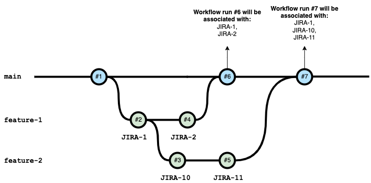

# Showing GitHub Actions builds in Jira

The GitHub for Jira app automatically processes "workflow runs" from any [GitHub Action workflows](https://docs.github.com/en/actions/learn-github-actions/workflow-syntax-for-github-actions) you have defined in your GitHub repositories and shows them in the "Builds" tab of the development info panel of a Jira issue:


To associate a workflow run with a Jira issue, **the app looks for Jira issue keys in all commit messages of a pull request**.

Let's at a common feature branching example:



We have two feature branches off the `main` branch. Say we have configured our GitHub Actions so that each commit on each of the feature branches (green dots) and each commit on the `main` branch (blue dots) triggers a workflow to build and test our codebase.

If we use the Jira issue keys (`JIRA-*`) in the commit messages as shown in the diagram, we would see workflow run #6 in the Jira issues `JIRA-1` and `JIRA-2` and workflow run #7 in the Jira issues `JIRA-1`, `JIRA-10`, and `JIRA-11`.

Workflow run #2 would be associated with the Jira issue `JIRA-1` only. Workflow run #4 would be associated with both `JIRA-1` and `JIRA-2`, because they're both part of the same pull request.

**IMPORTANT:** The app only looks for Jira issue keys in commits that were part of a pull request. In the above example, all commits on the `feature-1` and `feature-2` branches are part of a respective pull request into the `main` branch. 

**If you merge a branch into another branch without a pull request, only the last commit message on that branch will be searched for Jira issue keys**. 

To run your GitHub workflows on pull requests, make sure to include the branch name pattern of your pull request source branches in your GitHub workflow config like this:

```yaml
on:
  pull_request:
    branches:
      - main
      - feature**
```
