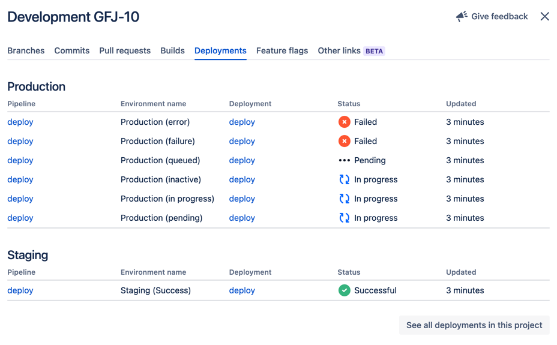
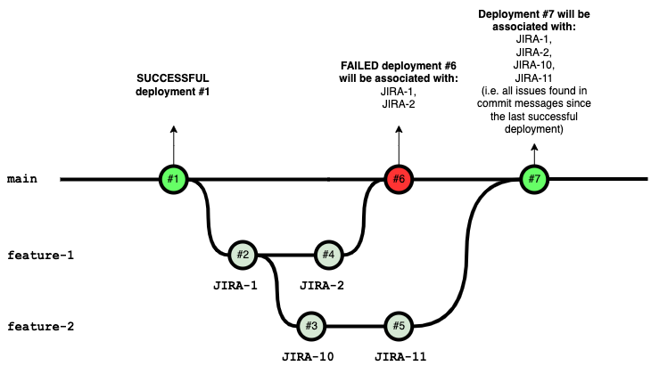

# Showing GitHub deployments in Jira

The GitHub for Jira app automatically makes deployments created against [GitHub's deployment API](https://docs.github.com/en/rest/reference/repos#deployments) visible in Jira issues:



## How are deployments associated with Jira issues?

To associate a deployment with a Jira issue, **the app looks for Jira issue keys in all commit messages on the deployed branch since the last successful deployment**.

Let's look at an example:



We have two feature branches off the `main` branch. Say we have configured our GitHub Actions so that each push on the `main` branch triggers a deployment. 

If we use the Jira issue keys (`JIRA-*`) in the commit messages as shown in the diagram, we will see the failed deployment #6 in Jira issues `JIRA-1` and `JIRA-2` and deployment #7 in ALL shown Jira issues (because none of the commits have been successfully deployed, yet).

To create deployments as a part of a GitHub Actions workflow, you can use [this deployment action](https://github.com/chrnorm/deployment-action), for example. Use the action `chrnorm/deployment-action@releases/v1` to create a deployment and don't forget to use the `chrnorm/deployment-status@releases/v1` to update the state of a deployment.

**The GitHub for Jira app only listens to `deployment_status` events**. Just creating a deployment via the [create deployment API](https://docs.github.com/en/rest/reference/repos#create-a-deployment) (or the `chrnorm/deployment-action@releases/v1` action) isn't enough. After creating a deployment you need to call the [create deployment status API](https://docs.github.com/en/rest/reference/repos#create-a-deployment-status) (or the `chrnorm/deployment-status@releases/v1` action) at least once to provide a status for that deployment (success, failure, pending, ...).


## Environment mapping

Each deployment event contains the name of the environment your app was deployed to. Jira needs to know whether the environment is a `development`, `testing`, `staging`, or `production` environment to give you the most value from the issue and deployment views.

So, the GitHub integration tries to guess the environment type from your environment name. If it contains the word `prod`, for example, it will be considered a `production` environment. If it contains the word `test`, it will be considered a `testing` environment, and so on.

If you are using custom environment names in your deployments (for example non-english environment names), we might not be able to resolve the correct environment type. You may see the message "undefined environment" in Jira:


If this is the case, you can add a file called `.jira/config.yml` to the main branch of your repository with the following content:

```yaml
deployments:
  environmentMapping:
    development:
      - "dev*"
      - "Entwicklung"
      - "desenvolvimento"
      - "дев"
    testing:
      - "testes"
      - "Test"
      - "TST-*"
      - "тест"
    staging:
      - "Pre-Prod"
      - "STG-*"
      - "staging"
    production:
      - "Produktion"
      - "produção"
      - "продакшн"
      - "PROD-*"
```

For each of the 4 valid environment types in Jira, you can specify up to 10 [glob patterns](https://en.wikipedia.org/wiki/Glob_(programming)).

In the above example, if the environment name from your deployment event is "TST-3", for example, it would show up as a deployment to a `testing` environment in Jira and if the environment name is "produção", it would show up as a `production` environment in Jira.

Note that once you add this configuration file, the automatic detection will back off, so you have to specify patterns for all of your environment names.