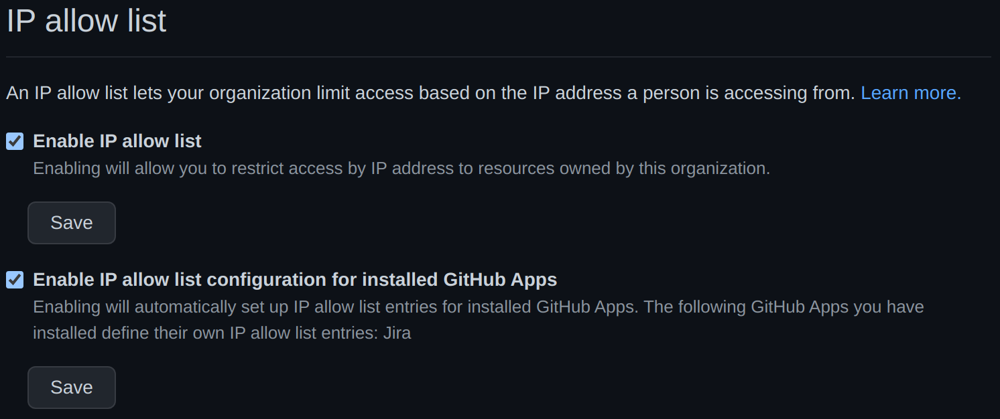

# GitHub IP Allow List Configuration

If your organization is using [GitHub's Organization IP Allow List](https://docs.github.com/en/organizations/keeping-your-organization-secure/managing-allowed-ip-addresses-for-your-organization), it needs to be configured properly for this Github app to be able to communicate with your organization's GitHub API.

There are 2 methods to remedy this based on your company's security policy:

1. a simple method which will enable _all_ GitHub apps with IPs specified in them to have access to your GitHub org's
   APIs (_recommended_)
2. a manual way by adding each CIDR ranges possible for this app to communicate from.

**We recommend using the first method** as you only have to set it once and never have to think about it again. If there are
any IP changes on our end in the future, we can just change the list on our end and it will automatically propagate to
your organization. But for this to happen, you must trust every GitHub app installed or else risk a potential security
breach by an app adding an attacker's IP to your allow list.

If you'd like complete control over your IP Allow List, then you can enter the CIDR ranges manually in your GitHub 
organization.  But it does come with the drawback that if the CIDR ranges ever change or a new one needs to be added,
you will have to manually update those as well.  Furthermore, we don't have a way to easily send a message 
to all GitHub org admins about a change like this and it could be possible that the integration might break because 
of the change.

### Simple Method

As an admin go to your GitHub org page `https://github.com/<your org>`, press on the `Settings` tab, then in the 
sidebar select the `Organization security` option.  Scroll down to the `IP allow list` section.  Both checkboxes `Enable IP 
allow list` and `Enable IP allow list configuration for installed GitHub Apps` should be selected and saved independently.



That's it!

### Manual Method

As an admin your GitHub org page `https://github.com/<your org>`, press on the `Settings` tab, then in the sidebar
select the `Organization security` option.  Scroll down to the `IP allow list` section until you can see the list of 
IP addresses with a `+ Add` button.  From here, you need to [add the whole list of CIDR ranges specified in this 
Atlassian 
document](https://support.atlassian.com/organization-administration/docs/ip-addresses-and-domains-for-atlassian-cloud
-products/#AtlassiancloudIPrangesanddomains-OutgoingConnections).

For simplicity, here's the list of CIDR ranges, but it might not be up to date:

```
13.52.5.96/28
13.236.8.224/28
18.136.214.96/28
18.184.99.224/28
18.234.32.224/28
18.246.31.224/28
52.215.192.224/28
104.192.137.240/28
104.192.138.240/28
104.192.140.240/28
104.192.142.240/28
104.192.143.240/28
185.166.143.240/28
185.166.142.240/28
```

## If problems persist

Feel free to [contact Atlassian support](https://support.atlassian.com/contact/#/?
inquiry_category=technical_issues&is_cloud=true&product_key=third-party-product) for guidance and extra help.